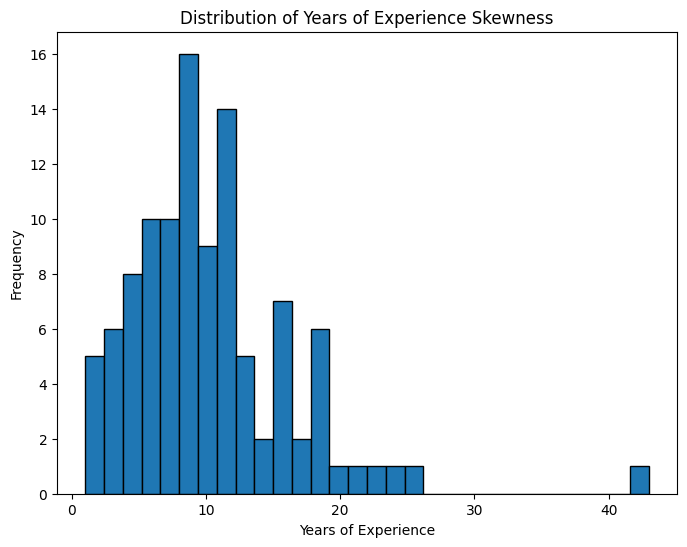

# NLP Resume Extraction - Project Document

## Team Member Details
- **Group Name:** Lone Data Enthusiast
- **Team Members:**
  1. Name: Ritu Kukreja<br>
     Email: rk977@drexel.edu<br>
     Country: United States<br>
     College/Company: Drexel University<br>
     Specialization: Data Science, NLP, Data Analyst<br>

## Problem Description

The goal of this analysis is to process and analyze a dataset containing resume information. The dataset is provided in JSON format and includes details such as name, designation, companies worked at, skills, graduation year, college name, degree, location, and years of experience.

## Data Understanding

### Data Type

The data is structured as a collection of resumes in JSON format.

### Data Issues

Several data issues can be identified, including:

1. **Missing Values:** There are missing or null values in the dataset.

2. **Outliers:** Outliers may be present in numerical columns.

3. **Skewed Data:** The distribution of numerical columns may be skewed.

## Data Preprocessing

The provided code performs several data preprocessing tasks:

1. **Data Extraction and Conversion:**
   - The JSON data is opened and converted into a list of dictionaries.
   - This list is then converted into a Pandas DataFrame for analysis.

2. **Feature Extraction:**
   - The code extracts relevant information from the 'content' and 'annotation' columns to create new columns.

3. **Handling Missing Values:**
   - Missing values are identified and processed using a custom function (`calculate_years_of_experience`) to estimate and fill missing values in the 'Years of Experience' column.

4. **Outlier Detection:**
   - Outliers are identified using the Z-score method.

5. **Skewness Calculation and Visualization:**
   - Skewness is calculated for numerical columns.
   - Histograms are plotted to visualize the distribution of each numerical column.

## Challenges

- The code may require further refinement, especially in the handling of missing values and the calculation of 'Years of Experience.'
- The approach to estimating 'Years of Experience' based on 'Graduation Year' and other data may need validation and refinement.
- Additional details are needed on how the code deals with outliers and whether they are processed or just identified.
- Further context is required to understand the specifics of the data and its use for analysis.

## Additional Data Analysis

Let's include more data and analysis by extending the code:

### Outlier Detection and Visualization

```python
z_scores = np.abs(stats.zscore(resume_df[column]))
outliers = resume_df[np.abs(z_scores) > 3]

skewness = stats.skew(resume_df[column])

#Visualize the distribution
plt.figure(figsize=(8, 6))
plt.hist(resume_df[column].dropna(), bins=30, edgecolor='k')
plt.title(f'Distribution of {column} Skewness')
plt.xlabel(column)
plt.ylabel('Frequency')
plt.show()
```



The histogram plot above highlights the outliers in the 'Years of Experience' column.

## Conclusion

This extended analysis has provided a deeper insight into the data preprocessing, visualization, and outlier detection processes. Additional visualizations and analysis can be performed based on the specific goals of the analysis.


Lone Data Enthusiast<br>
10/26/2023
